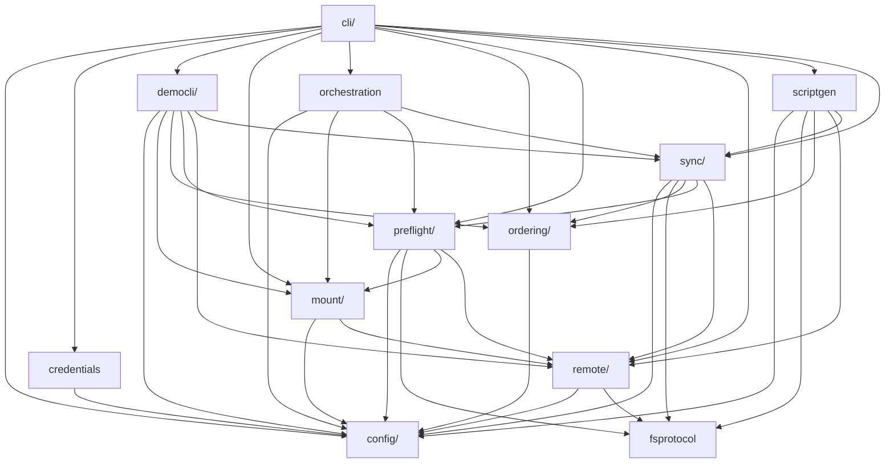

# Architecture

Module-level dependency graph for contributors navigating the codebase.

For the domain model and configuration reference, see [Concepts](./concepts.md). For runtime behavior and design decisions, see [Internals](./internals.md).

<!-- BEGIN MODULE OVERVIEW (auto-generated by: mise run depgraph — do not edit manually) -->
## Module Overview

Dependencies between top-level modules (auto-generated via `mise run depgraph`):

<!-- END MODULE OVERVIEW -->
