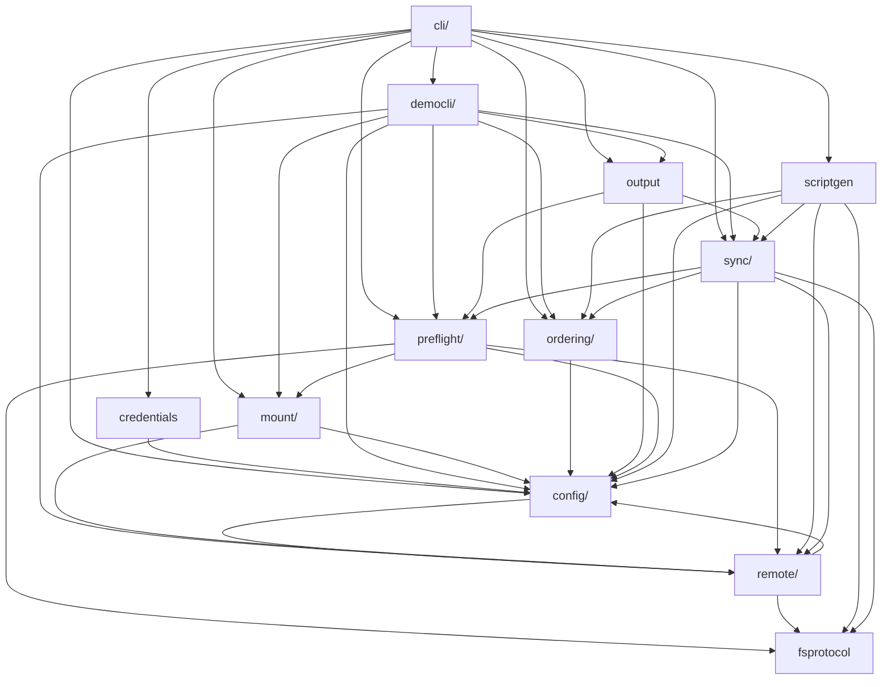
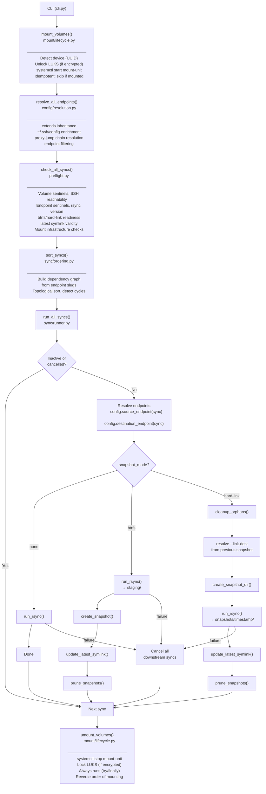

# Architecture

[README.md](../README.md) documents the main use cases and philosophy that guide the design of nbkp.

<!-- BEGIN MODULE OVERVIEW (auto-generated by: mise run depgraph — do not edit manually) -->
## Module Overview

Dependencies between top-level modules (auto-generated via `mise run depgraph`):

<!-- END MODULE OVERVIEW -->

## Execution Flow

## Design Decisions

### Mount Management

#### Why `systemd-cryptsetup` instead of raw `cryptsetup`

LUKS unlock uses `sudo systemd-cryptsetup attach` rather than `sudo cryptsetup open` for two reasons:

1. **systemd integration** — `systemd-cryptsetup attach` registers the device mapper with systemd's unit tracking. This means `systemctl stop systemd-cryptsetup@<mapper>.service` cleanly tears down the device, and tools like `systemctl status` and `journalctl -u` work as expected. Raw `cryptsetup open` creates the mapper outside systemd's awareness, making lock via `systemctl stop` unreliable.

2. **Consistent lock path** — Locking via `systemctl stop systemd-cryptsetup@<mapper>.service` works regardless of whether the device was opened by nbkp or by the system (e.g. via crypttab at boot). If we used `cryptsetup open`, we'd need `cryptsetup close` for lock, which would fight with systemd if it also manages the device.

#### Why polkit + sudoers (hybrid authorization)

Mount management uses two authorization mechanisms because `systemctl start/stop` and `systemd-cryptsetup attach` follow different privilege paths:

- **polkit** for `systemctl start/stop` — These commands go through D-Bus to systemd, which consults polkit for authorization. A polkit rule at `/etc/polkit-1/rules.d/50-nbkp.rules` grants the backup user permission to start/stop specific mount and cryptsetup units without a password.

- **sudoers** for `systemd-cryptsetup attach` — This is a direct binary invocation that needs root privileges (it accesses `/dev/disk/by-uuid/` and sets up device mapper). Polkit cannot authorize direct command execution; only sudo can. A sudoers rule at `/etc/sudoers.d/nbkp` grants `NOPASSWD` access to the specific `systemd-cryptsetup attach` commands.

Both are generated by `nbkp config setup-auth` from the config file, so the rules are always in sync with the configured volumes.

#### Why keyring as the default credential provider

The `keyring` library provides a cross-platform abstraction over OS-native secret stores (macOS Keychain, Linux SecretService/GNOME Keyring, KDE Wallet). This was chosen as the default because:

- **No plaintext secrets** — Passphrases are stored in the OS credential store, encrypted at rest.
- **Interactive setup** — `keyring set nbkp <passphrase-id>` provides a simple one-time setup that non-technical users can follow.
- **Session integration** — On desktop Linux, the keyring is typically unlocked at login and stays available for the session.

The `keyring` package is an optional dependency (`pip install nbkp[keyring]`) to avoid pulling in D-Bus/SecretStorage libraries on headless servers where `env` or `command` providers are more appropriate.

#### Why no action tracking for umount

`umount_volumes` always attempts to umount and lock every volume with mount config, rather than tracking which volumes were actually mounted by the current run. This avoids fragile state tracking across scenarios like:

- A `run` that fails partway through and is restarted
- A `volumes mount` followed by a `run --no-mount` followed by `volumes umount`
- A volume that was already mounted before nbkp started

The cost is negligible — `systemctl stop` on an already-stopped unit is a no-op — and the benefit is that cleanup is always complete regardless of how the session progressed.

#### Why mount unit names are derived at runtime

Mount unit names (e.g. `/mnt/seagate8tb` → `mnt-seagate8tb.mount`) are derived by running `systemd-escape --path <volume-path>` on the target host rather than being hardcoded or computed in Python. This is because systemd's escaping rules are non-trivial (hyphens in path components become `\x2d`, among other edge cases), and `systemd-escape` is the canonical implementation. The result is cached in `VolumeCapabilities.mount_unit` after the first preflight probe.

### Preflight Conditional Probing

The preflight check system uses two layers: an **observation layer** (`volume_checks.py`, `endpoint_checks.py`) that probes raw state, and an **error interpretation layer** (`status.py`) that decides what constitutes a problem based on config. Not all capabilities are checked for every volume or endpoint — probing is selective. This is an intentional design choice driven by three categories of conditional logic.

#### Physical cascade dependencies

Probe B requires the result of probe A as input. These conditions live in the observation layer because they represent physical impossibilities, not policy decisions:

- `rsync_version_ok` requires `has_rsync` — can't run `rsync --version` if rsync isn't installed
- `is_btrfs_filesystem` requires `has_stat` — needs `stat -f -c %T`
- `btrfs_user_subvol_rm` requires `has_findmnt AND is_btrfs`
- `mount_unit` derivation requires `has_systemd_escape` — needs the tool to compute the unit name
- `has_mount_unit_config` requires `mount_unit` — can't query a systemd unit without its name
- `staging_writable` requires `staging_exists`

#### Config-as-input probing

The probe itself needs config values as parameters — without them, the probe cannot be formulated. These also live in the observation layer:

- Encryption checks need `mapper_name` from `mount.encryption` — no mapper name means nothing to query
- `systemd-cryptsetup@{mapper}.service` lookup needs the mapper name from config
- `systemctl show {mount-unit}` needs the derived mount unit name

#### Config-as-filter probing

The probe is independent of config values, but only relevant when a feature is enabled. These are skipped in the observation layer to avoid unnecessary SSH round-trips (each check is a remote call):

- `snapshot_dirs` and `latest` symlink checks only run when `endpoint.snapshot_mode != "none"`
- `BtrfsStagingSubvolumeDiagnostics` only probed when `btrfs_snapshots.enabled` (plus physical prerequisites)

The error interpretation layer already filters based on these same config flags, so these probes could theoretically always run. However, always-probing would add 2–5 extra SSH calls per non-snapshot endpoint, which adds up across configs with many endpoints.

#### Why not always-probe

Consolidating all conditional logic in the error interpretation layer was considered and rejected:

- **Categories 1 and 2 cannot move** — they encode physical prerequisites, not policy. Moving them downstream would just replace cascade conditionals with null-checks in the error layer.
- **Category 3 saves real SSH round-trips** with minimal code complexity (2–3 lines of guards per check site).
- **The `| None` type convention** (meaning "not probed / not applicable") is consistently applied across all diagnostics models and well-understood by the error interpretation layer.
