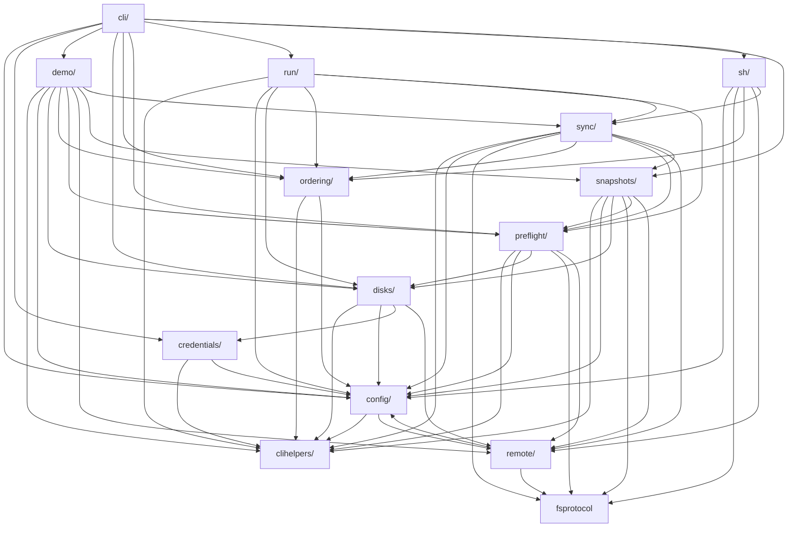

# Architecture

How nbkp is composed: the external tools it orchestrates (**Building Blocks**, below) and the module-level dependency graph (further down) for contributors navigating the codebase.

For the domain model and configuration reference, see [Concepts](./concepts.md). For runtime behavior and design decisions, see [Internals](./internals.md).

## Building Blocks

nbkp is a thin orchestrator over proven, standard tools — no custom storage format, transfer protocol, or encryption. It composes the following and defers to each for the hard parts:

### Data transfer

- **rsync** — does the actual file copy (incremental, delete-aware, filter rules), locally and over SSH. Files land as plain directories, so restoring is just a copy. Flag defaults and the `--hard-links` rationale: [Rsync Defaults](./internals.md#rsync-defaults); exact invocations: [Rsync synchronization](./internals.md#rsync-synchronization).
- **SSH** — transport and remote control. rsync runs over the OpenSSH `ssh` client (`-e ssh`, proxy-jump chains), while preflight checks, snapshot operations, and the mount lifecycle run remote commands via Fabric/Paramiko. The best reachable endpoint is chosen per run: [Endpoint Filtering](./internals.md#endpoint-filtering); SSH option mapping: [SSH transport](./internals.md#ssh-transport).

### Mount management (Linux)

- **udisks2** (`udisksctl`) — the single backend for the unlock → mount → umount → lock lifecycle of removable and encrypted drives, on local and remote hosts alike. No `sudo` and no `systemctl` in the mount path: [Volume Mount Management](./internals.md#volume-mount-management), [Why udisks2](./internals.md#why-udisks2).
- **polkit** — the *only* authorization mechanism for udisks. A single generated rule (`50-nbkp.rules`) lets the backup user unlock/mount/lock without a password — required because nbkp runs over SSH or from a timer in an inactive session: [Why polkit-only](./internals.md#why-polkit-only).
- **LUKS / dm-crypt** (`cryptsetup`) — full-volume encryption for backup destinations. At runtime nbkp never calls `cryptsetup` directly: udisks unlocks/locks the container and nbkp discovers the cleartext device, so the operator only uses `cryptsetup` once, to create the LUKS volume: [Volume Mount Management → Encrypted volumes](./internals.md#volume-mount-management), [Why no `dm-crypt` kernel module check](./internals.md#why-no-dm-crypt-kernel-module-check).

### Snapshots

- **btrfs** (`btrfs-progs`) — copy-on-write, space-efficient point-in-time snapshots: rsync writes to a `staging` subvolume, then a read-only snapshot is taken. Pruning needs the `user_subvol_rm_allowed` mount option: [Snapshot Lifecycle](./internals.md#snapshot-lifecycle), [Btrfs snapshot operations](./internals.md#btrfs-snapshot-operations).
- **Hard links** — the filesystem-agnostic alternative to btrfs snapshots: rsync `--link-dest` references the previous snapshot so unchanged files are shared. Works on any filesystem with hard-link support: [Snapshot Lifecycle](./internals.md#snapshot-lifecycle), [Hard-link snapshot operations](./internals.md#hard-link-snapshot-operations).

### Discovery & safety

- **Sentinel files** (`.nbkp-vol` / `.nbkp-src` / `.nbkp-dst`) — nbkp's own guard, not an external tool: a sync runs only when all its sentinels are present, so an unmounted or wrong drive is skipped rather than written to: [Sentinel Files](./internals.md#sentinel-files).
- **util-linux / coreutils** (`findmnt`, `lsblk`, `stat`, `which`, `test`, …) — the small probes behind preflight and mount discovery: `findmnt` (where a device is mounted + live mount options), `lsblk` (the unlocked cleartext device), `stat` (btrfs detection). Their availability is itself checked: [Pre-flight Checks](./internals.md#pre-flight-checks); the full command list is in the [External Commands Reference](./internals.md#external-commands-reference).

### Credentials

- **keyring** (OS secret stores: macOS Keychain, Linux SecretService, …) — the default source for LUKS passphrases. They stay on the operator's machine and are delivered to the server only transiently at unlock time, never stored server-side: [Why keyring as the default credential provider](./internals.md#why-keyring-as-the-default-credential-provider).

<!-- BEGIN MODULE OVERVIEW (auto-generated by: mise run depgraph — do not edit manually) -->
## Module Overview

Dependencies between top-level modules (auto-generated via `mise run depgraph`):

<!-- END MODULE OVERVIEW -->
