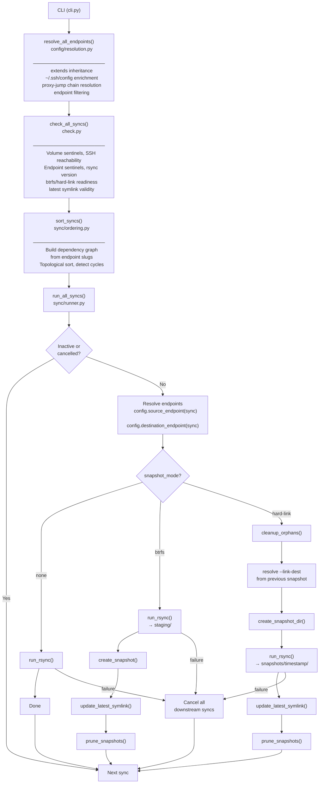

# Architecture

## Module Overview

```
nbkp/
  config/
    protocol.py      Config model: volumes, SSH endpoints, sync endpoints, syncs
    loader.py         YAML loading, search order, validation
    resolution.py     SSH endpoint resolution (enrichment, proxy chains)
  remote/
    ssh.py            SSH CLI argument building (-e "ssh -p PORT -i KEY ...")
    fabricssh.py      Fabric/Paramiko connections for status checks and btrfs ops
    resolution.py     Endpoint filtering (location, private/public, DNS)
  sync/
    ordering.py       Topological sort, dependency graph, failure propagation
    rsync.py          Rsync command building and execution
    btrfs.py          Btrfs snapshot creation, listing, pruning
    hardlinks.py      Hard-link snapshot creation, orphan cleanup, pruning
    symlink.py        latest symlink management (read/update)
    runner.py         Orchestrator: check → sort → dispatch per snapshot mode
  check.py            Pre-flight validation (sentinels, SSH, rsync, btrfs, hard-link)
  scriptgen.py        Compile config into standalone bash script
  output.py           Rich/JSON formatting for all commands
  cli.py              Typer CLI: check, run, sh, prune, troubleshoot, config show
  democli.py          Demo/QA helpers: seed environments, render sample output
```

## Execution Flow


