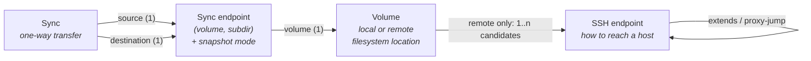

# Domain

The ideas nbkp is built on: what problem it models, the entities in a config and how they relate, and the rules that decide whether, in what order, and with what outcome each backup runs. Read this to reason about a setup — or about a change to the code — at the level of *volumes and syncs* rather than YAML fields or shell commands.

For every config field, see the [Configuration Reference](./config-reference.md). For how the rules below are carried out at runtime, see [Internals](./internals.md). For how the code is organized, see [Architecture](./architecture.md).

## The Problem Space

nbkp backs up data in setups where **nothing is always available**: a laptop that moves between networks, removable drives that are plugged in some days and not others, a home server reachable on the LAN at home and only through a public hostname on the road. A backup runs *when its pieces happen to be present*, and is skipped — safely and quietly — when they are not.

Three consequences shape the whole domain:

- **Presence must be proven, not assumed.** A missing drive's mountpoint is just an empty directory; writing a backup there would fill the wrong disk and leave the real one stale. nbkp therefore treats every location as absent until marker files prove otherwise (see [Sentinels](#sentinels-presence-is-proven)).
- **"Skipped" is a normal outcome, not a failure.** A drive that is not plugged in is the expected state most of the time. The domain distinguishes *inactive* (not ready, try again later) from *broken* (needs fixing) — see [Inactive vs Broken](#inactive-vs-broken).
- **One machine is in charge.** A single **orchestrator** — typically the laptop — runs nbkp, holds the SSH keys and drive passphrases, and initiates every transfer. Servers only need standard tools (`rsync`, optionally `btrfs` and `udisks2`); they hold no credentials. Data can still flow server-side (see [Direction](#direction)), but control always starts at the orchestrator. Why multi-server topologies are out of scope: [README → Non-Goals](../README.md#non-goals).

Backups are **plain directory trees** written by rsync. There is no repository format to decode: restoring is a copy.

## The Model at a Glance

A config is a single YAML file declaring four kinds of entities, each defined once under a slug and referenced by slug elsewhere:



Reading the arrows bottom-up: an **SSH endpoint** says how to reach a host; a **volume** is a filesystem location, local or on a host reached through SSH endpoints; a **sync endpoint** is a specific directory inside a volume, with an optional snapshot policy; a **sync** copies one sync endpoint to another.

The layering exists so that each fact is stated once. A host's connection details are shared by all its volumes; a drive is declared once however many directories on it are backed up; a directory's snapshot policy is attached to the directory itself rather than repeated in every sync that touches it.

## Entities

### SSH Endpoint

*How the orchestrator reaches a remote host*: hostname, port, user, key, connection options, and optionally a chain of bastion hosts (`proxy-jump`). Endpoints can `extends` one another to share settings — e.g. a `nas-wan` endpoint that is `nas-lan` with a different hostname. Unset fields fall back to `~/.ssh/config`, so a config can stay minimal for hosts already set up there.

An endpoint describes a *route*, not a machine. The same server typically has several — one per network context — each tagged with a **location** (`home`, `travel`, …). That tag is what makes [network context](#network-context-choosing-a-route) work.

### Volume

*A named filesystem location* — the unit whose presence is checked.

- A **local volume** is a path on the orchestrator.
- A **remote volume** is a path on a host, with one primary SSH endpoint and optionally several candidate endpoints to choose from at runtime.

A volume typically corresponds to a drive or a well-known data root (`/mnt/usb-backup`, `~/`, `/srv/data` on the NAS). It carries no role: whether it acts as a source or a destination is decided entirely by the syncs that reference it, so the same drive can hold originals that get backed up *and* receive backups of other data (a **dual-role** volume).

A volume can also be **mount-managed**: it declares the device's UUID (and, for LUKS-encrypted drives, a passphrase id), and nbkp unlocks and mounts it before a run and unmounts and locks it afterwards. See [Mount-managed Volumes](#mount-managed-volumes).

### Sync Endpoint

*A specific directory inside a volume*: a `(volume, subdir)` pair plus an optional **snapshot mode** (`btrfs` or `hard-link`, mutually exclusive).

Sync endpoints are the nodes of the backup graph. Two invariants keep that graph unambiguous:

- **One endpoint per location.** No two sync endpoints may point at the same `(volume, subdir)`, nor may one be nested inside another on the same volume. Otherwise two endpoints could disagree about the snapshot layout of one directory, and nbkp could not tell that a sync writing into one feeds a sync reading from the other.
- **Snapshot mode belongs to the location.** It describes how the directory is laid out on disk, so it is configured on the endpoint, and its meaning depends on the role: as a destination, it means "take a snapshot after each successful sync"; as a source, it means "read from the latest snapshot, not from the live directory".

### Sync

*A one-way rsync transfer* from a source sync endpoint to a destination sync endpoint, with its own rsync flags and filter rules (which files to include or exclude). A sync can be disabled without being deleted.

**One writer per destination.** Each sync endpoint is the destination of at most one sync. A destination is a mirror of exactly one source (`rsync --delete`), so two writers would keep erasing each other's data.

#### Direction

Each side of a sync is local or remote, giving four combinations:

| Source → Destination | Data path |
|---|---|
| local → local | on the orchestrator |
| local → remote | orchestrator → host over SSH |
| remote → local | host → orchestrator over SSH |
| remote → remote, **same host** | entirely on the host; the orchestrator only drives it |

Remote → remote across *different* hosts is rejected: the orchestrator's credentials describe how *it* reaches each host, not how hosts reach each other. Two syncs through a local volume achieve the same result.

## The Backup Graph

Syncs connect sync endpoints into a directed graph. When the destination endpoint of sync A is the source endpoint of sync B, B depends on A: A is **upstream**, B is **downstream**. This is how **chained** backups are expressed — e.g. laptop → server drive (A), then server drive → second server drive (B). A drive that receives data and then fans it out to others is called a **relay** in the [tutorial](./tutorial.md#the-topology-were-building).

Dependencies are derived from the shared endpoint slug; they are never declared. Two rules follow:

- **Execution order** — syncs run in topological order, so an upstream sync always finishes before its downstream syncs start.
- **Failure propagation** — if a sync fails, or is skipped because it is inactive, every sync downstream of it (directly or transitively) is **cancelled** rather than run on stale or partial data. Syncs with no dependency on it continue normally.

For example, with chain `A → B → C` and an unrelated sync `D`: if A fails, B and C are cancelled and D still runs.

`nbkp ordering graph` renders the graph of a given config.

## Availability

### Sentinels: Presence Is Proven

Every location involved in a sync must carry a marker file, created once by the operator:

| Sentinel | Where | Proves |
|---|---|---|
| `.nbkp-vol` | Volume root | The volume is mounted and is the expected one |
| `.nbkp-src` | Source endpoint directory | This directory is meant to be backed up |
| `.nbkp-dst` | Destination endpoint directory | This directory is meant to receive a backup |

A sync is **active** only when all four sentinels it needs are present (`.nbkp-vol` on both volumes, `.nbkp-src` on the source, `.nbkp-dst` on the destination) and, for remote volumes, the host is reachable. Otherwise it is **inactive** and skipped. Sentinels are hidden from and protected against rsync, so a sync never copies or deletes them.

The split between volume and endpoint sentinels separates two questions: *is the drive there?* (`.nbkp-vol`) and *did someone intend this directory to take part in a backup, in this role?* (`.nbkp-src` / `.nbkp-dst`). A dual-role directory — a relay — carries both endpoint sentinels.

### Network Context: Choosing a Route

A remote volume may list several candidate SSH endpoints. At each run, nbkp picks one: it discards endpoints whose hostname does not resolve, then narrows by the operator's hints — the current **location** (`--location home`, `--exclude-location travel`) and **network type** (`--network private` for LAN, `public` for WAN). Hints are soft: a filter that would leave no candidate is ignored rather than failing the run.

The one hard filter: when *every* candidate endpoint of a volume is in an excluded location, the volume is skipped outright, with no SSH attempt, and its syncs become inactive. This turns "I know the NAS is unreachable from here" into a fast, quiet skip instead of a connection timeout. The full selection algorithm: [Endpoint Filtering](./internals.md#endpoint-filtering).

### Mount-managed Volumes

Removable and encrypted drives are often not mounted when a backup should run, and should not stay mounted (or unlocked) afterwards. A mount-managed volume brings that lifecycle into the run:

```
prefetch passphrases → unlock (LUKS) → mount → … syncs … → unmount → lock (LUKS)
```

- **Identity is the device UUID.** The drive is located by UUID, so the right physical device is used wherever it ends up mounted; the `.nbkp-vol` sentinel then confirms its content.
- **The mountpoint can be fixed or discovered.** Either the volume declares a `path` and the host's `/etc/fstab` maps the device there, or the path is omitted and nbkp discovers wherever the system mounted it.
- **Passphrases stay with the orchestrator.** A LUKS volume names a `passphrase-id`; the passphrase is fetched from a **credential provider** on the orchestrator (the OS keyring by default; also environment variable, external command such as `pass`, or interactive prompt) and sent to the host only for the unlock. Servers store none.
- **Cleanup is unconditional.** After a run, every mount-managed volume is unmounted and locked, whoever mounted it — so a failed or interrupted run never leaves a drive unlocked.

On Linux hosts this goes through udisks2, authorized by a single polkit rule. Mechanics, authorization, and the reasons behind each choice: [Volume Mount Management](./internals.md#volume-mount-management).

## Snapshots

A plain sync keeps one copy: the destination mirrors the source as of the last run, so a deletion or corruption at the source propagates on the next run. A **snapshot-enabled** destination instead keeps a history of point-in-time copies, each a complete browsable directory tree:

```
{destination}/
  latest       → snapshots/<newest complete timestamp>
  snapshots/
    2026-03-06T14:30:00.000Z/
    2026-03-05T10:00:00.000Z/
```

Two interchangeable backends trade portability against efficiency:

| | **btrfs** | **hard-link** |
|---|---|---|
| Filesystem | btrfs only | any with hard links (ext4, xfs, btrfs, … — not FAT/exFAT) |
| Mechanism | rsync into a `staging` subvolume, then an atomic read-only copy-on-write snapshot | rsync into a new directory, hard-linking unchanged files to the previous snapshot (`--link-dest`) |
| Cost of an unchanged file | shared blocks | a hard link (one inode, no data) |

Concepts common to both:

- **`latest`** points to the newest *complete* snapshot and moves only after a sync succeeds. A failed sync never changes what `latest` designates. Before the first success it points to `/dev/null`.
- **Snapshots as sources** — a downstream sync reading from a snapshot-enabled endpoint reads `latest`, so it always sees a consistent, completed backup, never one half-written.
- **Retention** — `max-snapshots` bounds the history; older snapshots are pruned after each run. The snapshot `latest` points to is never pruned.

Mechanics, orphan cleanup, and on-disk details: [Snapshot Lifecycle](./internals.md#snapshot-lifecycle).

## A Run

`nbkp run` takes a config through these steps:

1. **Prefetch credentials** — every passphrase the config declares, so OS approval prompts all happen up front.
2. **Mount** — unlock and mount the mount-managed volumes whose drives are present.
3. **Preflight** — probe every volume, endpoint, and sync: sentinels, reachability, tool versions, filesystem capabilities, snapshot layout. Each sync ends up active, inactive, or broken.
4. **Sync** — run active syncs in dependency order, snapshotting and pruning snapshot-enabled destinations.
5. **Unmount** — unmount and lock every mount-managed volume, even if an earlier step failed.

`preflight check` performs steps 1–3 and 5 without syncing; `preflight troubleshoot` does the same and explains how to fix each problem. `--dry-run` previews step 4.

### Inactive vs Broken

Preflight findings fall into two categories, mirroring the problem space:

- **Inactive** — the situation is expected and transient: a sentinel is missing, a drive is not plugged in, a host is unreachable or excluded by location. The sync is not ready *now*.
- **Infrastructure** (broken) — something is misconfigured and will not fix itself: rsync missing or too old, wrong filesystem for the snapshot mode, broken `latest` symlink, missing mount authorization.

**Strictness** decides what each category does to the run. By default (`ignore-inactive`) inactive syncs are skipped silently and infrastructure problems are fatal — the right setting for configs containing drives that are only sometimes attached. `ignore-none` also treats inactivity as fatal, for scheduled runs where everything is expected to be present; `ignore-all` attempts syncs despite infrastructure errors — but never one whose sentinels are not all present, since presence must still be proven. The exit-code matrix: [Strictness](./internals.md#strictness).

### Sync Outcomes

Each sync ends a run in one of four states:

| Outcome | Meaning |
|---|---|
| **success** | rsync completed (and the snapshot, if any, was taken) |
| **failed** | the sync ran and rsync or the snapshot step failed |
| **skipped** | inactive at preflight; never started |
| **cancelled** | an upstream sync failed or was skipped |

A cancellation is as serious as its cause: cancelled behind a skipped (inactive) sync, it is an expected non-run that does not fail the run under the default strictness; cancelled behind a failed sync, it is part of that failure.

Best-effort steps — orphan cleanup, pruning, removing a half-written snapshot directory — never change the outcome: when they fail, the sync's result carries a warning instead.

## Beyond `run`

The same model drives the other commands, each acting on part of it: `config show` (the model), `ordering graph` (the backup graph), `preflight` (availability), `disks mount` / `umount` (the mount lifecycle), `snapshots show` / `prune` (snapshot history), and `sh`, which compiles the config into a standalone bash script performing the same syncs, ordering, snapshots and failure propagation without Python — minus mount management, whose credential providers need Python. See the [CLI Reference](./cli-reference.md).

## Glossary

| Term | Meaning |
|---|---|
| **Orchestrator** | The machine running nbkp; holds SSH keys and passphrases, initiates every sync |
| **Volume** | A named local or remote filesystem location, usually a drive or data root |
| **Mount-managed volume** | A volume nbkp unlocks/mounts before a run and unmounts/locks after |
| **SSH endpoint** | One route to a remote host, optionally tagged with a location |
| **Location** | A network-context tag on an SSH endpoint (`home`, `travel`, …) |
| **Sync endpoint** | A `(volume, subdir)` pair with an optional snapshot mode; a node of the backup graph |
| **Sync** | A one-way rsync transfer between two sync endpoints; an edge of the backup graph |
| **Upstream / downstream** | Sync A is upstream of B when A's destination is B's source |
| **Relay** | A destination that also serves as the source of further syncs |
| **Dual-role volume** | A volume holding both sources and destinations |
| **Sentinel** | A marker file (`.nbkp-vol`, `.nbkp-src`, `.nbkp-dst`) proving presence and intent |
| **Active / inactive** | Whether a sync's sentinels and hosts are all present and reachable |
| **Snapshot** | A complete, point-in-time copy of a destination, kept under `snapshots/` |
| **`latest`** | Symlink to the newest complete snapshot (`/dev/null` before the first) |
| **Credential provider** | Where LUKS passphrases come from (keyring, env, command, prompt) |
| **Strictness** | Policy deciding whether inactive and infrastructure findings abort a run |
